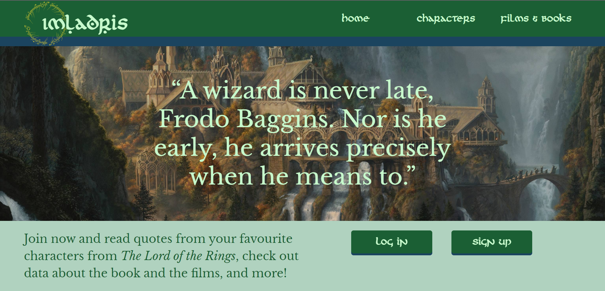

# Imladris
> 21/02/2022 -- Despliegue de Aplicaciones Web -- Documentar con GitHub y Markdown

[comment]: <> (Preview del sitio web)

## Diseño de Aplicaciones Web / Desarrollo Web en Entorno Cliente

### Autor: ***Javier Clavijo García***

---

## GitHub

- [Repositorio (DIW)](https://github.com/javiercg-daw/diw-UT4-imladris)
- [Repositorio (DWEC)](ttps://github.com/javiercg-daw/Proy1_ClavijoGarciaJavier_DWEC)

## Despliegue de la aplicación

- [GitHub Pages (DIW)](https://javiercg-daw.github.io/diw-UT4-imladris/)
- [GitHub Pages (DWEC)](https://javiercg-daw.github.io/Proy1_ClavijoGarciaJavier_DWEC/)

## Cambios respecto del prototipo:

1. General:
    - Pequeños cambios en tamaños de fuente, alineación de texto, etc. Motivo: mejorar la navegación a través de una
      mejor jerarquía visual, de una mejor distribución del texto, etc.
    - Cambio de la fuente First Order Light por First Order. Motivo: la primera está desactualizada y no se visualiza
      correctamente, sobre todo en pantallas de tamaño reducido.
2. Detalle de personaje (desktop): *layout* de la parte derecha cambiado de mosaico a columna vertical (tipo F). Motivo:
   mejorar la legibilidad del texto, lograr una mejor distribución visual en casos en los que haya pocos elementos.
3. Páginas de detalle:
    - (Desktop): los elementos de la parte derecha se ajustan al ancho del texto. Motivo: no dejar tanto espacio vacío.
    - (Mobile/desktop): añadida cabecera a parte derecha de la página. Motivo: esclarecer el propósito de la página y
      mejorar la usabilidad.
4. Header:
    - (Desktop): animación de movimiento del marcador de pestaña de la barra de navegación cambiada a *fade in/fade out*
      . Motivo: la animación de movimiento requería demasiado tiempo de desarrollo.
    - (Mobile): barra de navegación cambiada por menú desplegable. Motivo: mejorar la usabilidad y el aspecto en modo *
      mobile*, ya que la barra de navegación quedaba demasiado estrecha.
    - (Mobile): añadido nombre del sitio web. Motivo: como hemos cambiado la barra de navegación por el menú desplegable
      hay espacio para incluirlo, lo que mejora la estética del sitio y lo hace más identificable.
5. Footer (mobile): disposición de los elementos cambiada a lista vertical. Motivo: mejora la estética y la usabilidad,
   de forma similar al header.
6. Inicio (desktop): botones de login/registro movidos a la parte superior central del contenedor. Motivo: no dejar
   espacio vacío.
7. Contacto (mobile): imagen sin zoom. Motivo: que la imagen se vea completa en todos los dispositivos para lograr una
   mayor consistencia.
8. Lista de películas/libros (mobile): eliminado zigzag en disposición de las imágenes. Motivo: simplificar la
   navegación por la página.
